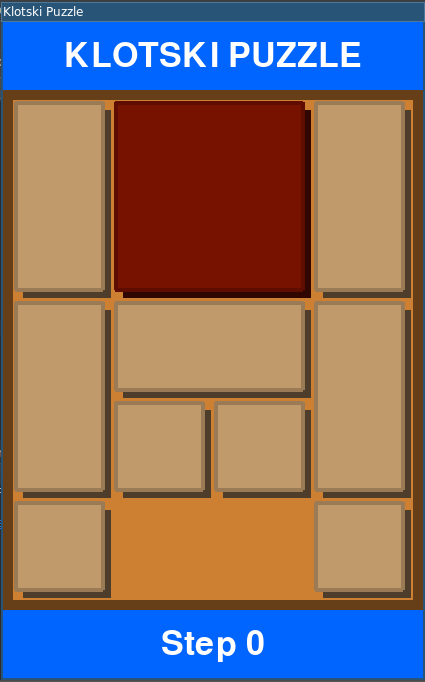

# KLOTSKI PUZZLE

Implements a [Klotski Puzzle](https://en.wikipedia.org/wiki/Klotski) in python3 using pygame.

## SETUP
Install required packages using  
    
    pip install -r requirements.txt

Launch the game using

    ./main.py

## HOW TO PLAY
Drag the pieces using the mouse to move them around in the board
Aim of the game is to move the largest piece to the bottom middle of the board.

## SHORTCUTS

    Q: quit the game
    R: reset the board
    ←: undo step
    →: redo step 
    ↓: undo step (fast) 
    ↑: redo step (fast)
    A: enable auto-solver
    S: enable auto-solver (fast)

## Additional Options

To record the game while play it, start the game with ``--record`` argument. (i.e. ``./main.py --record``)
By default, video is saved to *output.avi*.
To specify a output file, pass ``--file FILE`` argument. Make sure to use ``.avi`` extension

For more details, pass ``--help`` argument.

Find a simulation at [Youtube](https://www.youtube.com/watch?v=KRD5mJHbhUM)